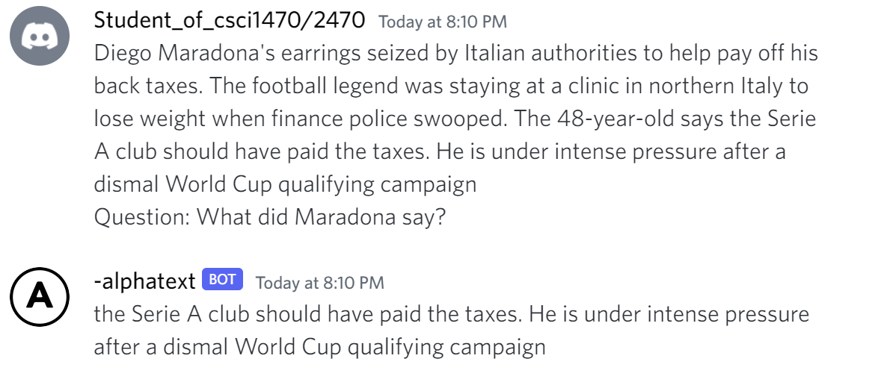
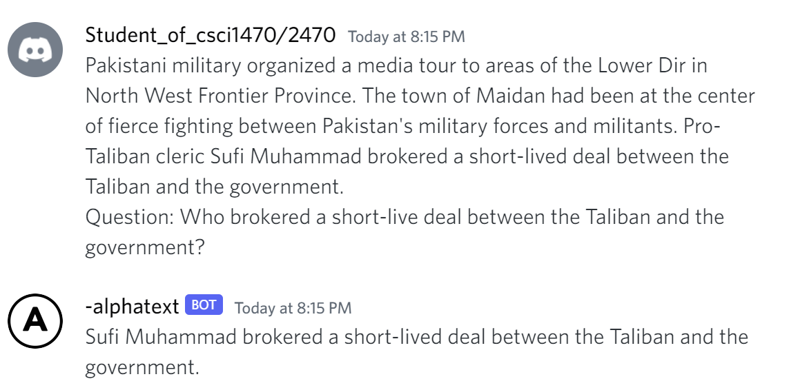

# Discord-Bot-Gpt3 AlphaText

AlphaText is a highly intelligent question answering bot. If you ask AlphaText a question that is rooted in truth, AlphaText will give you the answer. If you ask AlphaText a question that is nonsense, trickery, or has no clear answer, AlphaText will respond with Unkown.

Icon from: https://www.flaticon.com/free-icon/letter-a-inside-a-circle_12580

## Examples

User: What is human life expectancy in the United States?\
AlphaText: Human life expectancy in the United States is 78 years.

User: What is the square root of banana?\
AlphaText: Unknown.

## Demo

